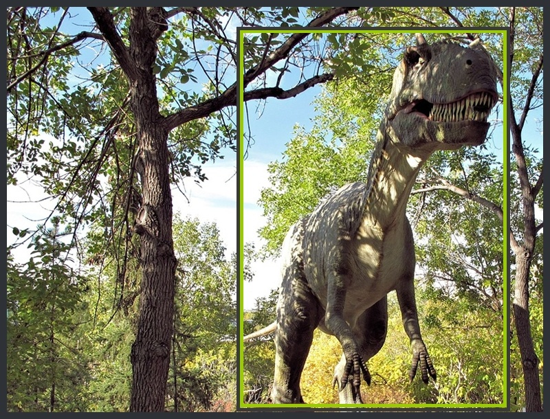
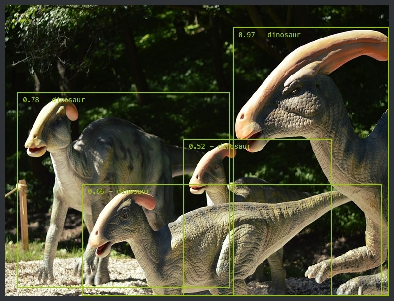
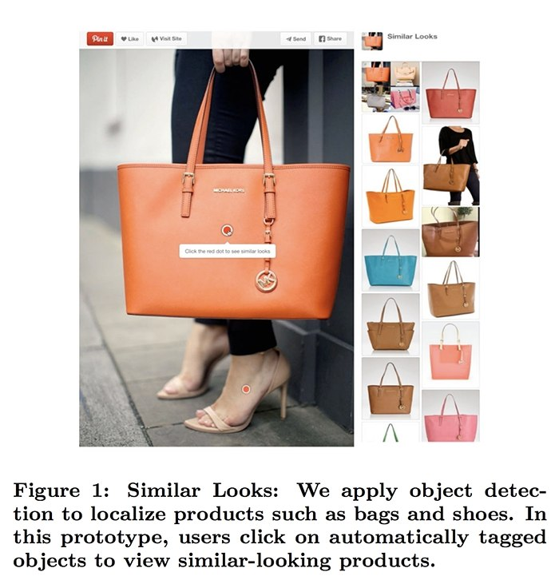
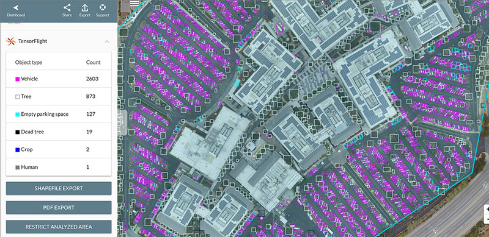

## Sundy
### Object Detection

### 1. Classification

   目前计算机视觉，学术界领域最最出名的问题就是图像分类问题，其中学术界最流行的数据集当属ImageNet. 其中每年的ILSVRC( ImageNet Large Scale Visual Recognition Challenge)竞赛就是用的该数据集。
  

### 2. Localization
Similar to classification, localization finds the location of a single object inside the image.
定位问题可以运用在很多有用的实际问题中，例如，智能切割(根据对目标的定位来进行切割)
  

### 3. Instance Segmentation
Going one step further from object detection we would want to not only find objects inside an image, but find a **pixel by pixel mask** of each of the detected objects. We refer to this problem as instance or object segmentation.

### 4. Object Detection
Object detection is the problem of finding and classifying a variable number of objects on an image.
  

### 5. Practical uses
#### 5.1 Face detection
Since the mid-2000s some point and shoot cameras started to come with the feature of detecting faces for a more efficient auto-focus. While it’s a narrower type of object detection, the methods used apply to other types of objects as we’ll describe later.

#### 5.2 Counting:

One simple but often ignored use of object detection is counting. The ability to **count people, cars, flowers, and even microorganisms**, is a real world need that is broadly required for different types of systems using images. Recently with the ongoing surge of video surveillance devices, there’s a bigger than ever opportunity to turn that raw information into structured data using computer vision.

#### 5.3 Visual Search Engine
Finally, one use case we’re fond of is the visual search engine of Pinterest. They use object detection as part of the pipeline for indexing different parts of the image. This way when searching for a specific purse, you can find instances of purses similar to the one you want in a different context. This is much more powerful than just finding similar images, like Google Image’s reverse search engine does.
 

#### 5.4 Aerial image analysis
In the age of cheap drones and (close to) affordable satellite launches, there has never been that much data of our world from above. There are already companies using satellite imagery from companies like Planet and Descartes Labs, applying object detection to count cars, trees and ships. This has resulted in high quality data, which was impossible (or extremely expensive) to get before, now reaching a broader audience.
 

## 6. Problems and challenges with object detection

### 6.1 Variable number of objects
We already mentioned the part about a variable number of objects, but we omitted why it’s a problem at all. When training machine learning models, you usually need to represent data into fixed-sized vectors. Since the number of objects in the image is not known beforehand, we would not know the correct number of outputs. Because of this, some post-processing is required, which adds complexity to the model.
Historically, the variable number of outputs has been tackled using a sliding window based approach, generating the fixed-sized features of that window for all the different positions of it. After getting all predictions, some are discarded and some are merged to get the final result.

### 6.2 Sizing

Another big challenge is the different conceivable sizes of objects. When doing simple classification, you expect and want to classify objects that cover most of the image. On the other hand, some of the objects you may want to find could be a small as a dozen pixels (or a small percentage of the original image). Traditionally this has been solved with using sliding windows of different sizes, which is simple but very inefficient.

### 6.3 Modeling
A third challenge is solving two problems at the same time. How do we combine the two different types of requirements: location and classification into, ideally, a single model?
Before diving into deep learning and how to tackle these challenges, let’s do a quick run-up of the classical methods.