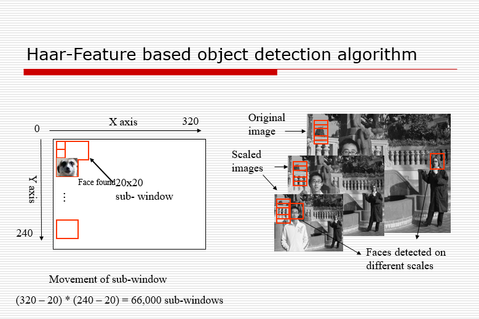
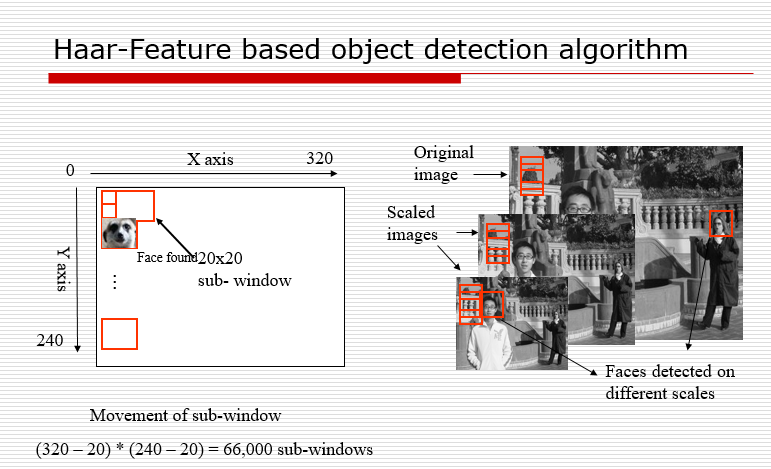
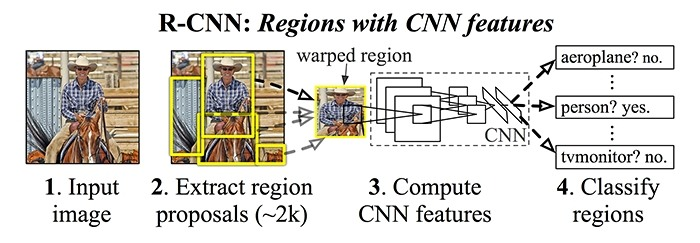
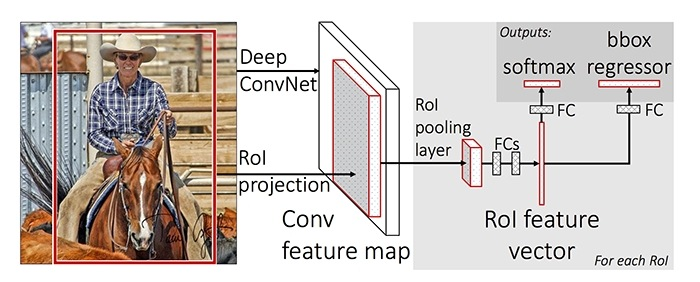
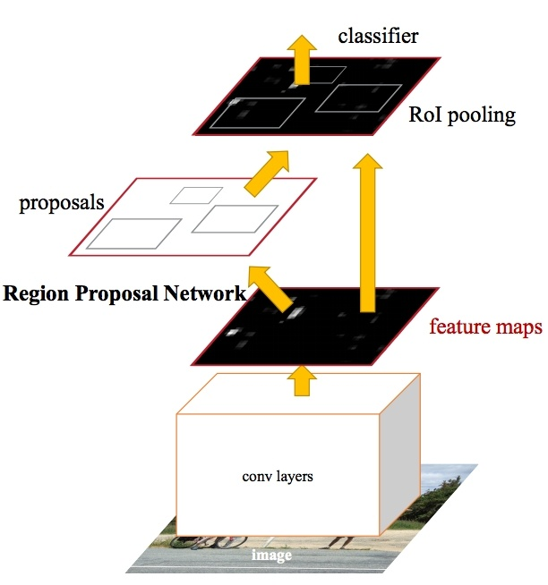
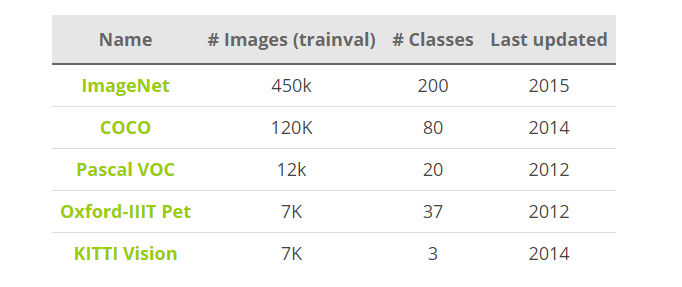

## Sundy

### Object Detection Approach
### 1. Classical approach
#### 1.1 Haar Cascade
[Viola-Jones framework](https://en.wikipedia.org/wiki/Viola%E2%80%93Jones_object_detection_framework) proposed in 2001 by Paul Viola and Michael Jones in the paper [**Robust Real-time Object Detection**](http://www.hpl.hp.com/techreports/Compaq-DEC/CRL-2001-1.pdf). 

We won’t go into details on how it works and how to train it, but at the high level, it works by generating different (possibly thousands) simple binary classifiers using **Haar features**. These classifiers are assessed with a multi-scale sliding window in cascade and dropped early in case of a negative classification.

Example1. [鼠标检测](http://blog.topspeedsnail.com/archives/10511)

#### 1.2 HOG(Histogram of Oriented Gradients)
Another traditional and similar method is using [**Histogram of Oriented Gradients (HOG)**](https://en.wikipedia.org/wiki/Histogram_of_oriented_gradients) features and Support Vector Machine (SVM) for classification. It still requires a multi-scale sliding window, and even though it’s superior to Viola-Jones, it’s much slower.

### 2. Deep Learning approach
It’s not news that deep learning has been a real game changer in machine learning, especially in computer vision. In a similar way that deep learning models have crushed other classical models on the task of image classification, deep learning models are now state of the art in object detection as well.
Now that you probably have a better intuition on what the challenges are and how to tackle them, we will do an overview on how the deep learning approach has evolved in the last couple of years.

#### 2.1 Overfeat

One of the first advances in using deep learning for object detection was [OverFeat](https://arxiv.org/abs/1312.6229) from NYU published in 2013. They proposed a multi-scale sliding window algorithm using **Convolutional Neural Networks (CNNs)**.

#### 2.2 R-CNN (2014)

Quickly after OverFeat, [Regions with CNN features or R-CNN](https://arxiv.org/abs/1311.2524) from [Ross Girshick](http://www.rossgirshick.info/), et al. at the UC Berkeley was published which boasted an almost 50% improvement on the object detection challenge. What they proposed was a three stage approach:

- Extract possible objects using a region proposal method (the most popular one being [Selective Search](http://www.huppelen.nl/publications/selectiveSearchDraft.pdf)).
- Extract features from each region using a CNN.
- Classify each region with [SVMs](https://en.wikipedia.org/wiki/Support_vector_machine).

[Girshick, Ross, et al. "Rich feature hierarchies for accurate object detection and semantic segmentation." 2014.](https://arxiv.org/abs/1311.2524)

#### 2.3 Fast R-CNN (2015)
This approach quickly evolved into a purer deep learning one, when a year later Ross Girshick (now at Microsoft Research) published Fast R-CNN. Similar to R-CNN, it used Selective Search to generate object proposals, but instead of extracting all of them independently and using SVM classifiers, it applied the **CNN on the complete image and then used both Region of Interest (RoI) Pooling on the feature map** with a final feed forward network for classification and regression. Not only was this approach faster, but having the RoI Pooling layer and the fully connected layers allowed the model to be end-to-end differentiable and easier to train. The biggest downside was that the model still relied on Selective Search (or any other region proposal algorithm), which became the bottleneck when using it for inference.

**Fast R-CNN Architecture.**

[Girshick, Ross. "Fast R-CNN" 2015.](https://arxiv.org/abs/1504.08083)

#### 2.4 YOLO (2016)
Shortly after that, [You Only Look Once: Unified, Real-Time Object Detection (YOLO)](https://arxiv.org/abs/1506.02640) paper published by Joseph Redmon (with Girshick appearing as one of the co-authors). YOLO proposed a simple convolutional neural network approach which has both great results and high speed, allowing for the first time real time object detection.

**YOLO Architecture.**

[**Redmon, Joseph, et al. "You only look once: Unified, real-time object detection." 2016.**](https://arxiv.org/abs/1506.02640)

#### 2.5 Faster-R-CNN (2015)
Subsequently, [Faster R-CNN](https://arxiv.org/abs/1506.01497) authored by Shaoqing Ren (also co-authored by Girshick, now at Facebook Research), the third iteration of the R-CNN series. Faster R-CNN added what they called a **Region Proposal Network (RPN)**, in an attempt to get rid of the Selective Search algorithm and make the model completely trainable end-to-end. We won’t go into details on what the RPNs does, but in abstract it has the task to output objects based on an “objectness” score. These objects are used by the** RoI Pooling and fully connected layers for classification**. We will go into much more detail in a subsequent post where we will discuss the architecture in detail.

**Faster R-CNN Architecture.**

[Ren, Shaoqing, et al. "Faster R-CNN: Towards real-time object detection with region proposal networks." 2015.](https://arxiv.org/abs/1506.01497)

#### 2.6 SSD 
[Single Shot Detector (SSD)](https://arxiv.org/abs/1512.02325) which takes on YOLO by using multiple sized convolutional feature maps achieving better results and speed.

#### 2.7 R-FCN 
[Region-based Fully Convolutional Networks (R-FCN)](https://arxiv.org/abs/1605.06409) which takes the architecture of Faster R-CNN but with only convolutional networks.

### 3. Importance of datasets

Reference

[https://handong1587.github.io/deep_learning/2015/10/09/object-detection.html](https://handong1587.github.io/deep_learning/2015/10/09/object-detection.html)
